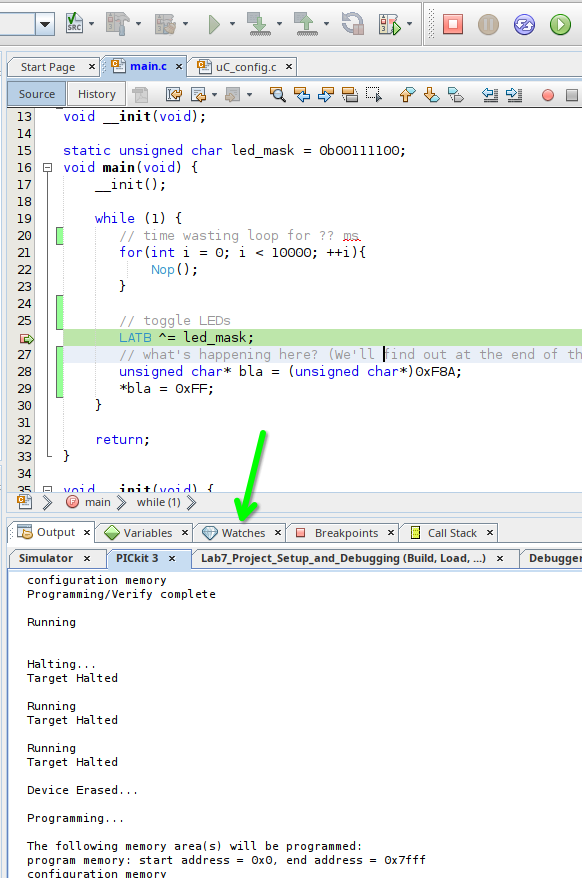
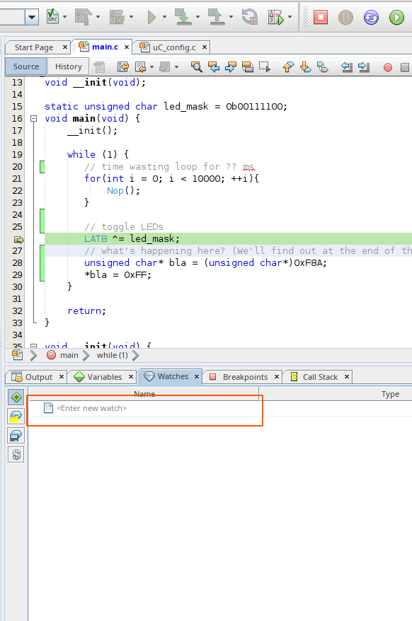
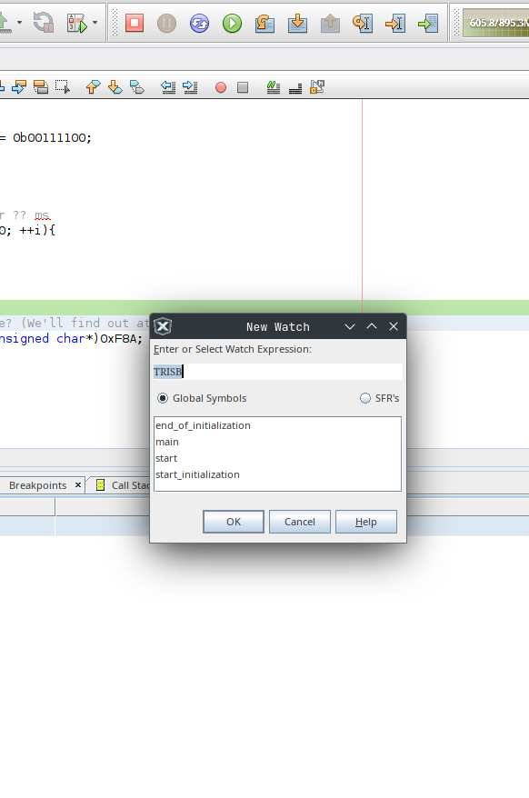
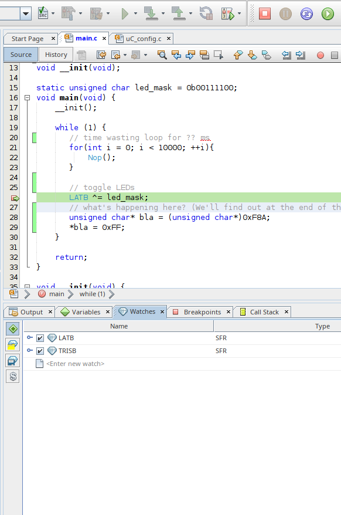
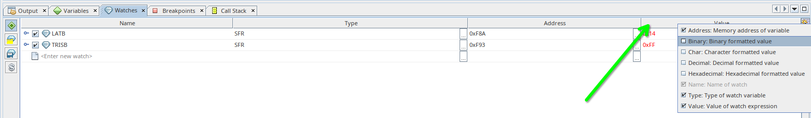

# Lab7_Project_Setup_and_Debugging

In this laboratory we will take a look at the fundamental settings necessary to set up a project and how to use the Simulator and the Debugger.
Therefore, we will
1. set up a new project
2. configure the Simulator and do some debugging with it and
3. configure the PICkit3 and do some debugging with it, too.
# Set up a new project
In order to set up a new project, open MPLAB as described in the last laboratory session.
When done your IDE should look similar to below picture (likely with the last lab still opened, but that doesn't matter). 
Now, to set up a new project click on the new project button as shown below.
 Now, a new window opens, where you can keep everything as is (see below image for comparison) and click "Next >".
It's time to select a device (a.k.a microcontroller). Therfore, select "Advanced 8-bit MCUs (PIC18)" from the Family drop-down and "PIC18F25K22" from the Device drop-down afterwards. Now click on "Next >"
After you've selected you device, a Compiler needs to be selected. Within this lecture we will use XC8 (v3.00). Select it, by clicking on it and click on "Next >"
Last but not least, you need to give you project a name and a location to be stored. Choose the name of the repository you just cloned and the folder where you cloned it into.
After clicking on "Finish" you should see below landing page. Well done, you just created a new project.
Usually you would write the code yourself. But today, we'll skip that and use the code provided via GitHub. Therefore we righ-click (place mouse over it and click the right instead of the left button) on "Soure Files" in the top left project view. Afterward, click on "Add Existing Item...".

A browser should open. Navigate to the just cloned folder and select main.c to be included.

Now that we have some code in our project, it's time to add the source file to configure our microcontroller. As it's more convenient, we use mainly default settings, and it's not necessary to code this file yourself, we will use the built in "Target Memory View" to create the configuration source code for us. To do so
1. click on "Window" in the menu bar (top of the IDE)
2. Click on "Target Memory View"
3. click on "Configuration Bits"

Afterward, a new tab should open (see next image).

This view enables you to configure every parameter within the configuration registers CONFIG1 to CONFIG7. Before clicking on "Generate Source Code to Output", make the following changes.
1. set FOSC to INTIO67, to use the internal oscillator and configure RB6 und RB7 as GPIO
2. set WDTEN to OFF, as we don't need it
3. set PBADEN to OFF in order to configure pins of PORTB as digital I/O
Now, click on "Generate Source Code to Output" and copy the generated code into your clipboard (highlight all -> STRG + C).

Now we need a new C Source File. Therefore, we right click again on "Source Files" in our Projects view, select New, and then click on C Source File...

Name the new file "uC_Config", in the just opened window.

Now your project is set up and the microcontroller has a sufficient configuration that is ensured even after a power-reset.
# Configure the Simulator and do some debugging
Now that we have a project, let's investigate it a bit. First, we will se what the Simulator of MPLAB can be used for. To do so, we need to configure it, too. To open the project's configuration click on the wrench symbol on the left center of the IDE, shown in below picture.

Within the "Project Properties" window you need to click on "Manage Configurations" on the bottom left of the window, in order to add a new configuration. We'll keep the default configuration for later.

Now, click on "New" and give the configuration a name in the just opened window, as shown below. I'd suggest you name it "Simulator".

Now click on "Ok" in both previously opened windows, to return to the "Project Properties" windows, where we will configure the simulator.
Select "Conf: Simulator" on the left of the window. Now, choose the same device as previously (PIC18F25K22), set the Tool to Simulator and select the XC8 (v3.00) Compiler again and click on "Apply".
If done, select "Simulator" on the left of the window to open the Simulator's configuration. Today, nothing needs to be done here. But keep in mind, that you need to set the "Instruction Frequency (Fcyc)" that matches with you configures oscillator frequency (Fosc). As the Fosc is set to 4MHz within the code, we can leave the configured Fcyc as 1MHz. Now, click "OK" to return to the IDE.

Back to the IDE you can change the configuration using the drop-down menu on the top left of the IDE. Select "Simulator" there.
For today, we will use the simulator to check how much time the for-loop is using. To debug the timing between different lines of code, we can use the provided Stopwatch of MPLAB. It can be opened by first clicking on "Window", then select Debugging, and afterwards clicking on Stopwatch. A new tab will open on the bottom view of the IDE.

Now we will set a breakpoint in line 21, by clicking on the line number (21). If a red square appears where you just clicked, a breakpoint is added. If, not replace the cursor and try again. After the breakpoint is set, click the debug symbol. While the code is being processed and flashed to the microcontroller, you can switch to the Stopwatch tab on the bottom view, by clicking on the Stopwatch tab.

As soon as the execution of the code reaches line 21 it will stop, and the line where the program was stopped will be highlighted in green (see picture below) and the time used since the last stop is shown in our Stopwatch tab. Now we can use the stopwatch to see how long one iteration of the loop will take. Hit the play button to do so.

A new entry in the stopwatch tab appears and shows us, that one iteration of the loop took 15µs. You should now be able to calculate the time required to process the complete loop. Do this, and continue with the below step, afterward.

Now that you calculated a duration necessary for processing the loop, we will stop our program to reset our breakpoints and check our assumptions using the Stopwatch. Therefore, click the stop button and remove the breakpoint in line 21, by clicking on it. Afterward, add new breakpoints to lines 20 and 23.

After the breakpoints are reset, we cann start our program again by clicking on the Debug symbol. As soon as the program is paused on the breakpoint in line 20, remove the breakpoint (again by clicking on it) and click in play. This will cause the loop to be executed entirely and the program to be paused when reaching line 23. This way the time required by the loop ist stopped.

Now check you assumption. Did you expect the loop to take 150.004 ms? I guess you didn't. You very likely calculated 150ms processing time for the loop. Which is correct, from the information you had. But if you take a look on your stopwatch you will see, that the loop took 150004 cycles. Why? One iteration took 15µs (or 15 cycles) before. Where are the 4 additional cycles coming from?
Your indexing variable i needs to be initialized. And this initialization takes the additional 4 cycles. Assumed you need to exactly waste 150ms, could you think of a way to do this with a modification of the existing loop?

Write down your approach to overcome this issue. I'll ask for the solution in the next lecture.
# Configure PICkit3 and do some debugging with it, too
Now, that we know how to use the Simulator and the Stopwatch, we will check how to debug code on the microcontroller itself.
Therefore, go back to the configuration drop-down menu on the top left of the IDE and select default.

When done, click on Debug and wait for the program to start. Check the output on the bottom view. When you se an error as shown below, you can got to the next image, to see how to configure the power supply via the PICkit3.

As the error states out, we need to supply the target voltage (VDD) to the board. This can be done using the PICkit3, but needs to be configured in the project properties. Click on the wrench symbol on the left center of the IDE to open them. If opened, select "Conf: \[default\]". In the configuration mask on the right select the correct device, if not already selected, and set the PICkit3 as "Connected Hardware Tool". Make sure XC8 (v3.00) is selected as compiler and click "Apply".

Now, we can configure the PICkit3 to provide the necessary voltag. Therefore, we select "PICkit3" in left column of the window and "Power" in the drop-down menu at the top center.

Now we activate "Power target circuit from PICkit3" and set the "Voltage Level" to 3.25. Click on "Apply" and then on "OK".

Back to the main window of the IDE, click on Debug and check whether or not the LEDs are blinking. They don't, right?
Then we should find out why, using breakpoints and the "Watches" Window.
We already know, that LEDs are controlled using the LATB register. Besides that TRISB sets the signal flow's direction (input or output), that could be an issue, too. To see if any of those registers are the root of our problem, we will set a breakpoint in line 26 and click on debug. As soon as you program is paused in line 26, open the Watches tab in the bottom view.

There you can add watches (e.g. register) you want to observe during debugging. Let's add LATB and TRISB, here. To do so double click on "\<Enter new watch\>".

And add the first register (e.g. TRISB) using the just opened window. Repeat this process for LATB.

If you're done adding those two registers, look at the next image to add the values binary view to the Watch.

Now that we can keep track of the changes of those registers, we will use the step over function to see which register changes when.
The step over button is the one next to the play button.

Use it to step through your code. After each click check the current register's value and ask yourself if it is what you would expect.
If not, comment out the line of code where the strange behavior took place, stop execution and click debug again, to check if you error is fixed. If so, great you're done for today. If not, investigate further or ask for help if you're stuck.

For those who still not understand what's happening in lines 28 and 29, I'll give an explanation in the next lecture.

