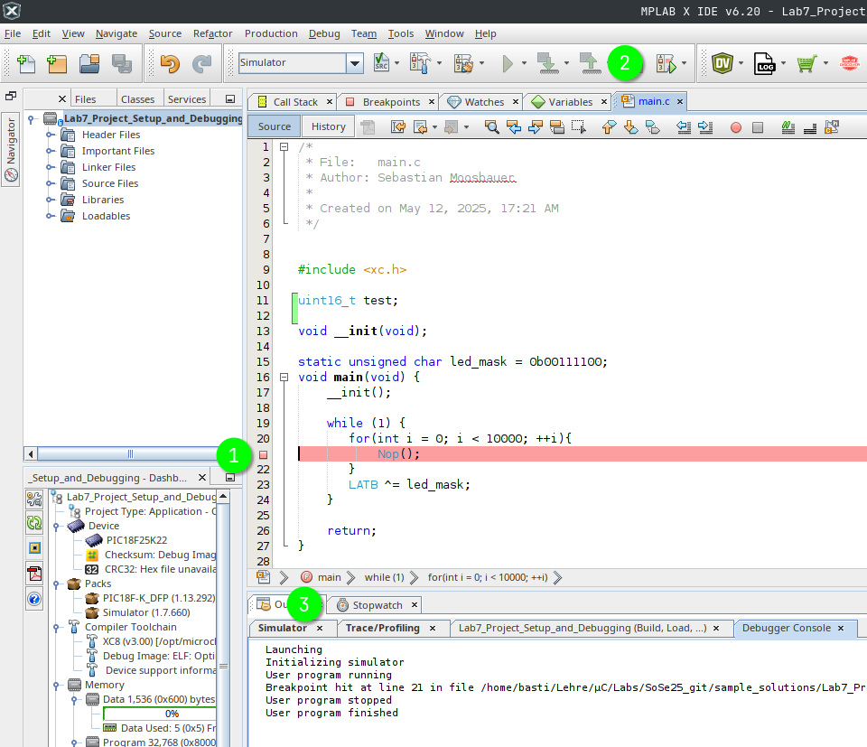

# Lab7_Project_Setup_and_Debugging

To manualize:
1. create new project
2. copy main.c
3. open configuration bits view
4. configure FOSC, WDTEN, LVP, PBADEN
5. create source code
6. copy source code to uC_Config.c
7. set PICkit3 as Tool
8. press Debug -> Error
9. configure voltage support from PICkit3
10. warning wegklicken
11. LEDs blinken, aber wie schnell?
12. Simulator Config zeigen
13. Stopwatch (for-loop)

In this laboratory we will take a look at the fundamental settings necessary to set up a project and how to use the Simulator and the Debugger.
Therefore, we will
1. set up a new project
2. configure the Simulator and do some debugging with it and
3. configure the PICkit3 and do some debugging with it, too.
# Set up a new project
In order to set up a new project, open MPLAB as described in the last laboratory session.
When done your IDE should look similar to below picture (likely with the last lab still opened, but that doesn't matter). 
Now, to set up a new project click on the new project button as shown below.
 Now, a new window opens, where you can keep everything as is (see below image for comparison) and click "Next >".
It's time to select a device (a.k.a microcontroller). Therfore, select "Advanced 8-bit MCUs (PIC18)" from the Family drop-down and "PIC18F25K22" from the Device drop-down afterwards. Now click on "Next >"
After you've selected you device, a Compiler needs to be selected. Within this lecture we will use XC8 (v3.00). Select it, by clicking on it and click on "Next >"
Last but not least, you need to give you project a name and a location to be stored. Choose the name of the repository you just cloned and the folder where you cloned it into.
After clicking on "Finish" you should see below landing page. Well done, you just created a new project.
Usually you would write the code yourself. But today, we'll skip that and use the code provided via GitHub. Therefore we righ-click (place mouse over it and click the right instead of the left button) on "Soure Files" in the top left project view. Afterward, click on "Add Existing Item...".

A browser should open. Navigate to you cloned folder and select main.c to be included.

Now that we have some code in our project, it's time to add the source file to configure our microcontroller. As it's more convenient, we use mainly default settings, and it's not necessary to code this file yourself, we will use the built in "Target Memory View" to create the configuration source code for us. To do so
1. click on "Window" in the menu bar (top of the IDE)
2. Click on "Target Memory View"
3. click on "Configuration Bits"

Afterward, a new tab should open (see next image).

This view enables you to configure every parameter within the configuration registers CONFIG1 to CONFIG7. Before clicking on "Generate Source Code to Output", make the following changes.
1. set FOSC to INTIO67, to use the internal oscillator and configure RB6 und RB7 as GPIO
2. set WDTEN to OFF, as we don't need it
3. set PBADEN to OFF in order to configure pins of PORTB as digital I/O
Now, click on "Generate Source Code to Output" and copy the generated code into your clipboard (highlight all -> STRG + C).

Now we need a new C Source File. Therefore, we right click again on "Source Files" in our Projects view, select New, and then click on C Source File...

Name the new file "uC_Config", in the just opened window.

Now your project is set up and the microcontroller has a sufficient configuration that is ensured even after a power-reset.
# Configure the Simulator and do some debugging

# Configure PICkit3 and do some debugging with it, too

